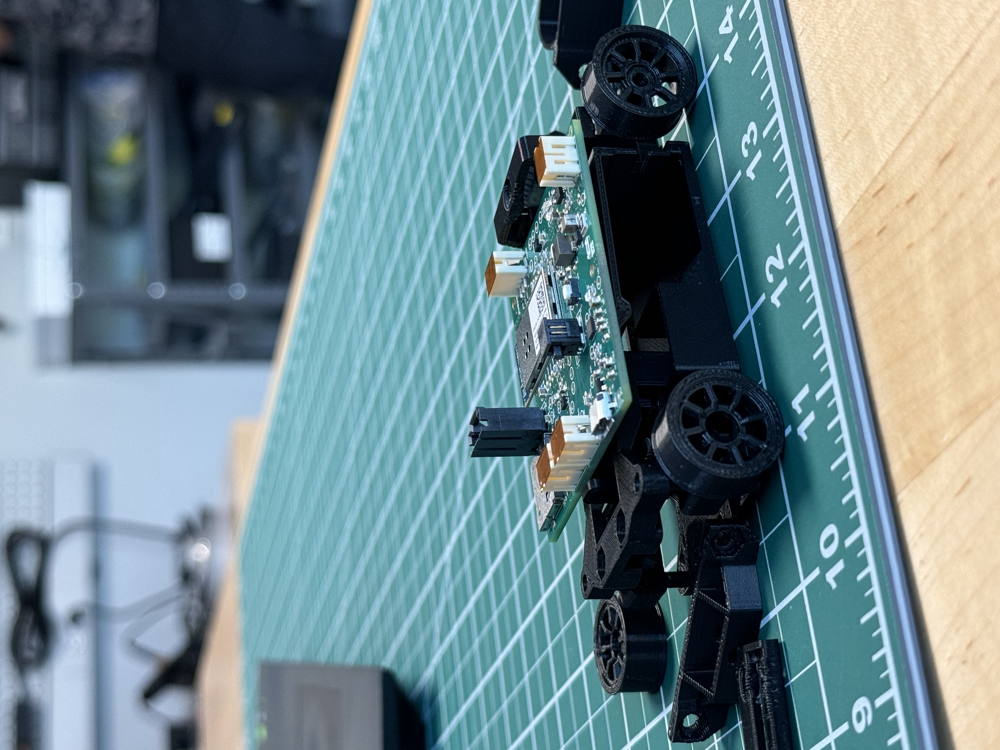

# a14g-final-submission

    * Team Number: 18
    * Team Name: DataRacers
    * Team Members: Saibaba Nargund, Deepak Shankar Ravisankar
    * Github Repository URL: https://github.com/ese5160/a14g-final-submission-t18-dataracers
    * Description of test hardware: Custom DataRacers PCBA

## 1. Video Presentation

 <https://youtu.be/YIpAmdMHwzU>

## 2. Project Summary

### Device Description

The Racecar Datalogger is an IOT device designed to monitor and record key performance metrics in a racecar during track events. It utilizes the SAMW25 microcontroller along with various sensors to measure engine RPM, acceleration forces, and engine temperature. The data is logged to an on-board SD card for post-race analysis. The device also provides real-time feedback to the crew via WiFi.

#### What problem is your device solving? How do you use the Internet so augment your device functionality?

The device we've developed aims to address the challenge of data logging in amateur racing leagues. We observed that while data is crucial for optimizing racecar setups and driver performance, existing solutions are often prohibitively expensive, complex to install and operate, and designed for professional teams with substantial budgets.

Our device offers a cost-effective and user-friendly alternative tailored specifically for amateur racing clubs and drivers. It provides essential data logging functionalities without unnecessary complexities, making it accessible to a broader range of users operating on minimal budgets.

To augment our device's functionality, we leverage the internet in several ways:

1. Data Analysis and Visualization: We utilize the Nodered platform and tools to analyze and visualize the data collected by our device. This enables users to gain insights into their performance, identify areas for improvement, and make data-driven decisions for optimizing their racecar setups and driving techniques.

2. Remote Monitoring and Support: Through internet connectivity, we offer remote monitoring and support services. This allows us to troubleshoot issues, provide software updates, and offer guidance to users regardless of their geographical location, enhancing the overall user experience and ensuring continuous functionality of our device.

Overall, by integrating internet-enabled functionalities into our device, we enhance its usability, accessibility, and value proposition, empowering amateur racing enthusiasts to harness the power of data to improve their performance on the track.

### Inspiration

#### What inspired you to do the project?

Our inspiration for this project stemmed from our passion for Formula One racing. As avid fans of the sport, we were deeply fascinated by the high-stakes, high-speed world of professional racing and the cutting-edge technology employed by Formula One teams to gain a competitive edge.

However, as we delved deeper into the world of motorsports, we realized that the vast majority of racing enthusiasts operate in amateur leagues with significantly smaller budgets compared to their professional counterparts. Despite their passion and dedication, these amateur racers often face numerous challenges, including limited access to advanced technology and data analytics tools.

This realization sparked the idea of developing a solution that could democratize access to data logging technology for amateur racing leagues and drivers. Rather than trying to reinvent the wheel in the professional racing sphere, we saw an opportunity to make a meaningful impact by addressing the specific needs and challenges of the amateur racing community.

By focusing on data logging—a critical aspect of optimizing racecar performance and driver skill—we aimed to create a solution that would empower amateur racers to enhance their competitiveness and enjoyment of the sport. Our goal was to leverage our expertise and passion for motorsports to develop a practical, affordable, and user-friendly device that could level the playing field and enable amateur racers to unlock their full potential on the  track.

### Device Functionality

Our device monitors RPM data, on-board temperature data, and acceleration data using our on-board IMU. RPM data is used to monitor the speed of the vehicle and enables the servo to use the RPM data to control the spoiler of the vehicle. The spoiler is actuated using a servo which is programmed to adapt to the RPM values. On-board temperature data can be used to monitor either engine temperature, tire temperature, brake temperature, or ambient vehicle temperature. Acceleration values can be used to monitor g-forces on all axes of the vehicle and cornering forces as well. This data is streamed in real-time to the node-red dashboard using the cloud and Wi-Fi. This enables real-time monitoring of our data. The device can also store this data for future analysis and match performance analysis to devise strategies. Along with this, we can update our device over the cloud and control the servo from the cloud as well.

### Challenges

Our challenges included the integration of the servo motor with the SAMW25 microcontroller, particularly due to the active spoiler system. The servo's activation depended on the motor's RPM, which required considerable effort to configure properly. Additionally, the 3D printing process for our model proved to be time-consuming. Originally, we intended for the 3D model to feature maneuverability, envisioning printed components like the wheelbase and axle. However, after printing, we encountered static components, unable to move as intended. This issue, coupled with the need for more power to propel the car, led us to power only one part of the wheel.

### Prototype Learnings

Building and testing our prototype, which involved custom PCB design, 3D modeling, and sensor-microcontroller integration using Atmel Studio, taught us valuable lessons. We learned the importance of proper power circuitry and signal routing, especially for I2C communication, to ensure the PCB's functionality. Using Altium Designer improved our skills in handling complex circuit designs. Although initially unfamiliar, learning CAD modeling with SolidWorks was a rewarding experience. Understanding real-time operating systems (RTOS) allowed us to integrate multitasking, improving the device's responsiveness and reliability. Employing Git for version control enhanced our collaborative coding efforts and project workflow. Rigorous testing and streamlined project management were crucial for hardware and software integration.

### Next Steps

- We can re-design the PCB to support CAN communication and OBD support in next iterations of this device which will help in higher granularity and accurate transfer of data than I2C or SPI. This will also standardise our device and bring it on-par with industry automotive standards.

- Additional ports can be added to support a wide range of sensors. This might even involve changes to the memory and power requirements of our design.

- Device enclosure can be re-designed to meet with IP standards.

- Integrating a Display in future design will enable the driver to keep track of their vehicle performance parameters.

### Takeaways from ESE5160

- ESE5160 helped in experiencing the product design timeline right from ideation to execution.

- Adapting to the project need and demands.

- Troublshooting and coming up with innovative ideas to make things work as intended.

- NEVER GIVE UP!!

### Project Links

### [Node-Red Dashboard](http://172.191.242.245:1880/ui/)

### [A12G Code Repository](https://github.com/ese5160/a12g-firmware-drivers-t18-dataracers)

### [Altium 365](https://upenn-eselabs.365.altium.com/designs/B30BCA82-12BB-4789-9F4A-3266D740E17A)

## 3. Hardware & Software Requirements

### Hardware Requirements Specification (HRS)

| Num | Components                  | Manufacture Number | Interface | Operating Voltage                         |
| --- | --------------------------- | ------------------ | --------- | ----------------------------------------- |
| 1   | Temperature Sensor          | SHTC3-TR-10KS      | I2C       | 1.62V ~ 3.6 V                             |
| 2   | TFT LCD Display             | ST7735R            | I2C       | 3.3V or Ultra-low dropout 3.3 V regulator |
| 3   | Accelerometer               | LS2DH12            | I2C       | Wide supply voltage, 1.71 V to 3.6 V      |
| 4   | Actuator Adafruit Feather   | 3119               | I2C       | 100mA                                     |
| 5   | RPM Sensor                  | 55100-3H-02-A      |           | 20mA                                      |

#### Abbreviations

TFT: Thin Film Transistor, I2C: Inter-Integrated Circuit, DRS: Drag Reduction System, RPM: Revolutions per minute

**HRS 01:** The microcontroller shall be a SAMD21 Cortex-M0+ based MCU from Microchip

**HRS 02:** A temperature sensor, designated by the manufacturer number SHTC3-TR-10KS, shall be utilized. It shall employ the I2C interface for communication, and the specified operating voltage for the sensor shall fall within the range of 1.62V to 3.6V. The sensor shall provide temperature accuracy of ±0.2°C over a range of -40°C to 125°C.This configuration shall serve the purpose of monitoring the temperature of the tires/engine.

**HRS 03:** A TFT LCD display with the manufacturer number ST7735R shall be utilized. Communication with the display shall occur through the I2C interface. The operating voltage for the display shall be either 3.3V or Ultra-low dropout 3.3V regulator.

**HRS 04:** A three-axis linear accelerometer LIS2DH12 shall be employed for maneuvering data. It shall provide ±2g/±4g/±8g/±16g selectable full scales. It shall communicate through the I2C interface.
The accelerometer operates within a wide supply voltage range, specifically 1.71V to 3.6V.

**HRS 05:** An actuator shall be integrated to simulate a Drag Reduction System (DRS) flap. We've opted to utilize Adafruit's Power Relay Featherwing to emulate the actuation of the car's flap. The relay consumes 100mA from the 3.3V power supply.

**HRS 06:** RPM Sensor (55100) shall serve as a compact flange-mounted hall effect sensor, mandated for measuring the RPM of the formula car. The Sensor draws 20mA of power.

Data Transmission Information recorded by the data logger shall be transmitted to external software for monitoring and data acquisition.
This hardware setup aims to provide a comprehensive solution for monitoring and optimizing the performance of a Formula Car, capturing crucial data related to temperature, acceleration and speed.

### Software Requirements Specification (SRS)

**SRS 01:** The system shall read temperature data from the SHTC3 sensor every 500ms

**SRS 02:** The system shall read 3-axis acceleration data from the LIS2DH12 sensor every 100ms

**SRS 03:** The system shall read RPM data from the RPM sensor every 100ms

**SRS 04:** The system shall log all sensor data to the on-board SD card in CSV format

**SRS 05:** The system shall transmit the sensor data over WiFi to the trackside computer once per second

**SRS 06:** The system shall provide a real-time dashboard display of temperature, RPM, and acceleration on the TFT LCD

**SRS 07:** The system shall actuate the DRS flap when commanded by the external software

## 4. Project Photos & Screenshots

### 3D Printed Race-Car

### Test Setup

### Custom PCBA Top

### Custom PCBA Bottom

### Custom PCBA Thermals

### Altium Board Design 2D

### Altium Board Design 3D

### Node-Red Dashboard Frontend

### Node-Red Dashboard Backend

### System Block Diagram

## 5. A12G Codebase

### [A12G Code Repository Link](https://github.com/ese5160/a12g-firmware-drivers-t18-dataracers)

### [Node-Red Dashboard Link](http://172.191.242.245:1880/ui/)

### [Altium 365 Link](https://upenn-eselabs.365.altium.com/designs/B30BCA82-12BB-4789-9F4A-3266D740E17A)

## 6. Demo Day

# Thank you for being a part of DataRacers
